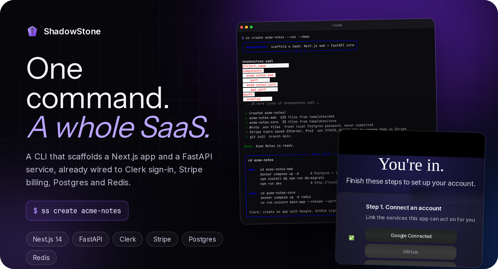
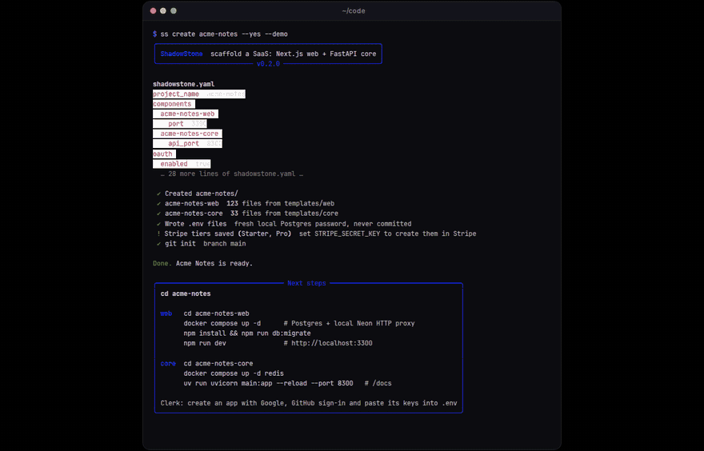
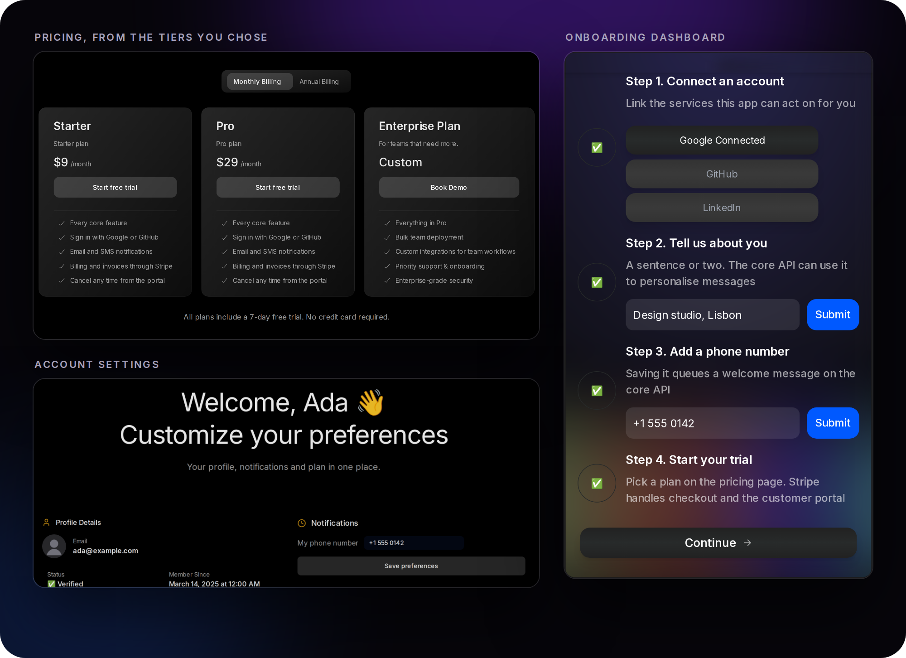
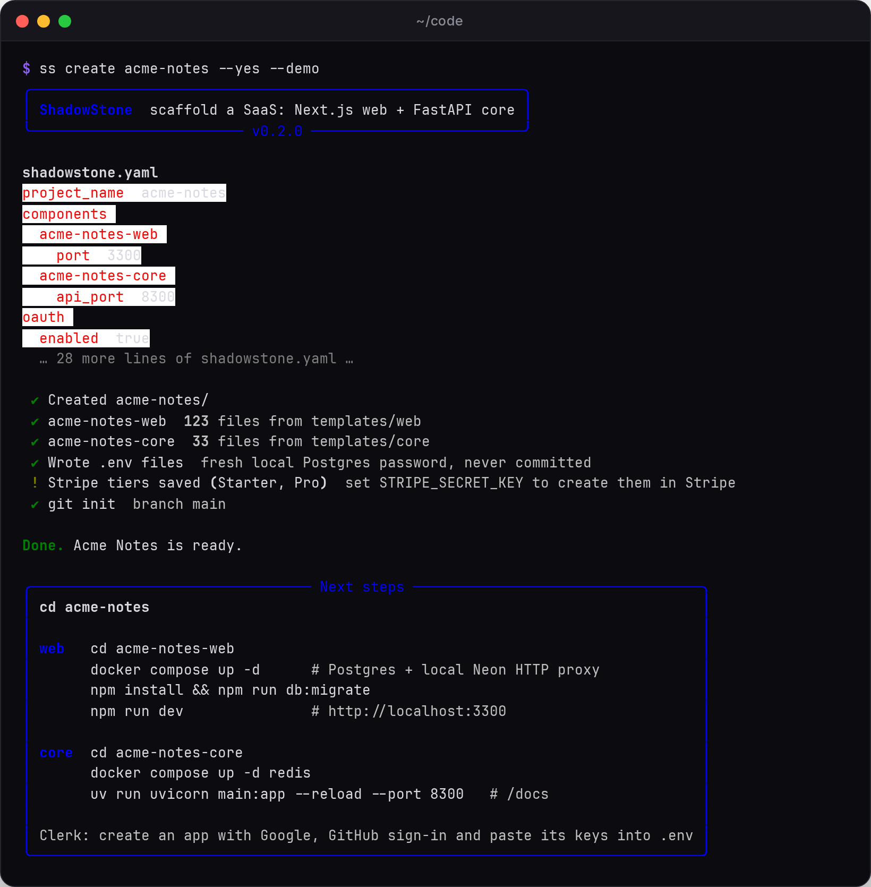
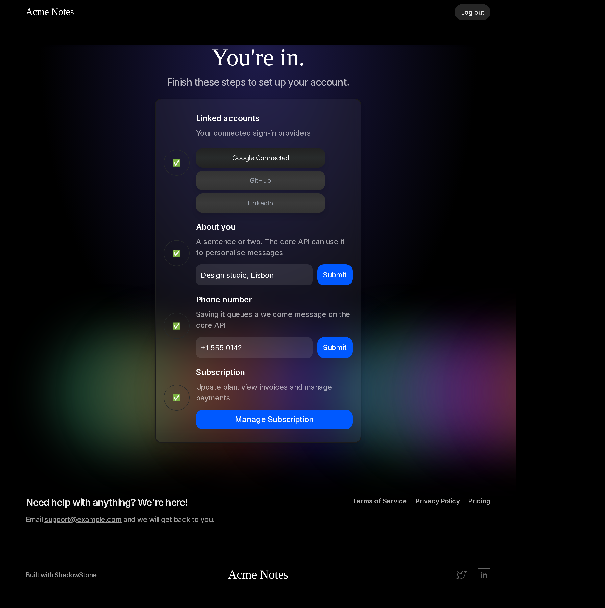
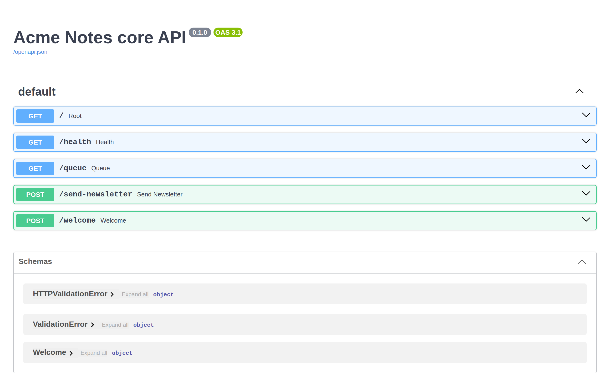
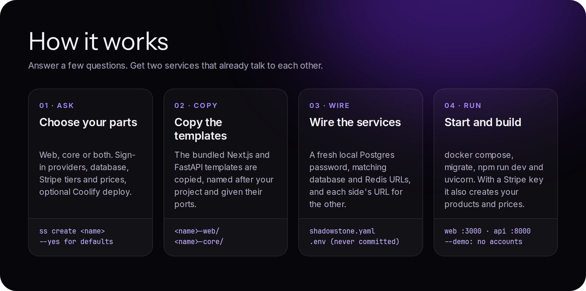

<div align="center">

<a href="#see-it-work">
  
</a>

<br>

**[Demo](#see-it-work)** ·
**[What you get](#what-you-get)** ·
**[How it works](#how-it-works)** ·
**[Quick start](#quick-start)** ·
**[Configuration](#configuration)** ·
**[Status](#status)**

<br>

[](shadowstone_cli)
[](templates/web)
[](templates/core)
[](#what-you-get)
[](LICENSE)

</div>

ShadowStone is a small CLI that scaffolds a SaaS in one command: a Next.js web app and a FastAPI service, already wired to Clerk sign-in, Stripe subscriptions, Postgres and Redis.
Answer a few questions (or pass `--yes`) and you get two folders that run and talk to each other.

## See it work

<div align="center">
  
  <br>
  <sub>Recorded headless on a fresh scaffold. The terminal output is the real <code>ss create</code> transcript. In the app, Postgres, Redis and the FastAPI core are real; Clerk and Stripe are the built-in <code>--demo</code> stand-ins. Ada Park and Acme Notes are invented.</sub>
</div>

<br>

<div align="center">
  
</div>

## What you get

### One command, two services

```console
$ ss create acme-notes
```

The CLI asks which parts you want, which sign-in providers, how to run the database, your Stripe tiers and prices, and whether to create a Coolify project. Then it writes:

```
acme-notes/
├── shadowstone.yaml      # every answer, so `ss add` can extend the project later
├── acme-notes-web/       # Next.js 14 + Clerk + Stripe + Drizzle (Postgres)
└── acme-notes-core/      # FastAPI + Celery + Redis + SQLAlchemy
```

Both folders get a `.env` with a fresh local Postgres password, the matching database and Redis URLs, and each side's URL for the other. `.env` files are git-ignored, and the project starts with `git init` on `main`.



The full, unedited transcript is in [`docs/cli-create.txt`](docs/cli-create.txt).

### Web: sign-in, pricing, onboarding, settings

`<name>-web` is a Next.js 14 App Router app:

- **Clerk** sign-in with the providers you picked, and a webhook that creates the user row.
- **Pricing** read live from Stripe, with a monthly and yearly toggle, Stripe Checkout with a 7-day trial, the customer portal and a subscription webhook.
- **Middleware** sends signed-out users to `/login`, and users without an active or trialing subscription to `/pricing`.
- An **onboarding dashboard** (connect an account, tell us about you, add a phone number, start a trial) and a **settings** page.
- **Drizzle** schema and migrations for users, customers, subscriptions and preferences, through the Neon serverless driver. Locally, `docker compose up -d` starts Postgres plus a Neon HTTP proxy, so the same driver works offline.



### Core: an API with a queue and workers

`<name>-core` is a FastAPI service:

| Route | What it does |
| --- | --- |
| `GET /health` | checks Postgres and Redis |
| `GET /queue` | lists messages waiting in Redis |
| `POST /welcome` | queues a welcome message; the web app calls it when a user saves a phone number |
| `POST /send-newsletter?email=` | queues a newsletter for one user |

Celery beat runs a producer and a consumer on a schedule. There is an optional Gemini summary step with a Jinja email template, and Mailtrap for sending. Each optional service stays off while its key is blank.



### Demo mode, no accounts needed

`ss create <name> --demo` sets `NEXT_PUBLIC_DEMO_MODE=1`. The web app then swaps Clerk and Stripe for small local stand-ins in [`templates/web/src/demo`](templates/web/src/demo). You are signed in as an invented user, the pricing page shows the tiers you chose, and "Start free trial" writes a real `trialing` row to Postgres. Everything else stays real; that is how the screenshots above were made. Never turn demo mode on in production.

## How it works



- The templates ship inside the package (`templates/web`, `templates/core`). `ss create` copies them, renames them after your project and sets the ports.
- `.env` values are filled in from each template's `.env.example`. Comments and order are kept, so you can still see every setting you have not filled in.
- If `STRIPE_SECRET_KEY` is set, the CLI creates one Stripe product per tier and one price per interval. If `COOLIFY_URL` and `COOLIFY_API_TOKEN` are set, it creates a Coolify project. If not, it says so and carries on.
- `ss add web` or `ss add core` adds the other half to an existing project later. It reuses the project's Postgres password.

## Quick start

You need Python 3.10+, [uv](https://docs.astral.sh/uv/) (or pip), Node 20+ and Docker.

```bash
git clone https://github.com/enzihub/shadowstone && cd shadowstone
uv tool install .            # or: pip install .   (installs `ss` and `shadowstone`)

cd ~/code
ss create acme-notes --yes --demo
```

Then follow the "Next steps" panel the CLI prints:

```bash
cd acme-notes/acme-notes-web
docker compose up -d          # Postgres + local Neon HTTP proxy
npm install && npm run db:migrate && npm run db:seed
npm run dev                   # http://localhost:3000

cd ../acme-notes-core
docker compose up -d redis
uv run uvicorn main:app --port 8000      # http://localhost:8000/docs
```

Drop `--demo` and fill in the Clerk and Stripe keys in `acme-notes-web/.env` to run against real accounts.

If ports 5432, 4444, 6379, 3000 or 8000 are taken, set `SS_POSTGRES_PORT`, `SS_NEON_PORT`, `SS_REDIS_PORT`, `SS_WEB_PORT` or `SS_API_PORT` before `ss create`. The demo above used 55440, 4460, 6390, 3300 and 8300.

## Configuration

The CLI itself needs nothing. These are all optional ([`.env.example`](.env.example)):

| Variable | Used for |
| --- | --- |
| `STRIPE_SECRET_KEY` | create your tiers as Stripe products and prices (use a `sk_test_` key) |
| `COOLIFY_URL`, `COOLIFY_API_TOKEN` | create a Coolify project for deployment |
| `SHADOWSTONE_TEMPLATES` | use your own copy of the `templates/` folder |
| `SS_POSTGRES_PORT` and friends | local ports, see above |

The scaffolded apps have their own `.env.example` files with every key blank: [web](templates/web/.env.example) (Clerk, Stripe, database, analytics) and [core](templates/core/.env.example) (database, Redis, Gemini, Clerk, Sentry, Mailtrap).

## Status

Built by Enzi Studio in 2025 as an internal starter for our own products, and shared as is. It is not maintained and no support is promised.

- **Checked for this release:** `ss create` and `ss add` run from a clean install. The scaffolded web app installs, migrates, seeds and serves the pricing, demo checkout, dashboard and settings flow with no browser console errors. The core API passes its health check against Postgres and Redis, queues the welcome message the web app sends, and its tests pass.
- **Not checked here:** real Clerk and Stripe accounts, the Stripe product-creation path, the Coolify call, the Gemini and Mailtrap pipeline, and the Docker image builds.
- The core's newsletter pipeline is a skeleton. `TODO` markers show where your content source goes.
- Dependencies date from early 2025, apart from Next.js, which was moved to 14.2.35 for its security fixes. Expect to update them.

## Credits

Built by Enzi Studio. Code by [@RukshanJS](https://github.com/RukshanJS), [@kavishkanimsara](https://github.com/kavishkanimsara), [@ZainAli104](https://github.com/ZainAli104), [@bb-xops](https://github.com/bb-xops), [@sun2ii](https://github.com/sun2ii) and [@harrythentrepreneur](https://github.com/harrythentrepreneur).

The docs page uses Inter, Instrument Serif and JetBrains Mono under the SIL Open Font License ([`docs/fonts/OFL.txt`](docs/fonts/OFL.txt)).

## Licence

[MIT](LICENSE) © 2025-2026 Enzi Studio (Harry Edwards)
